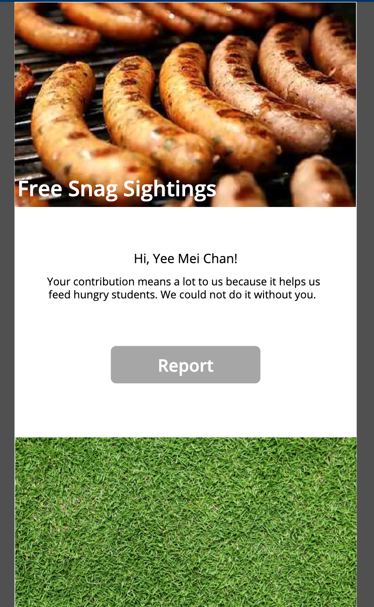
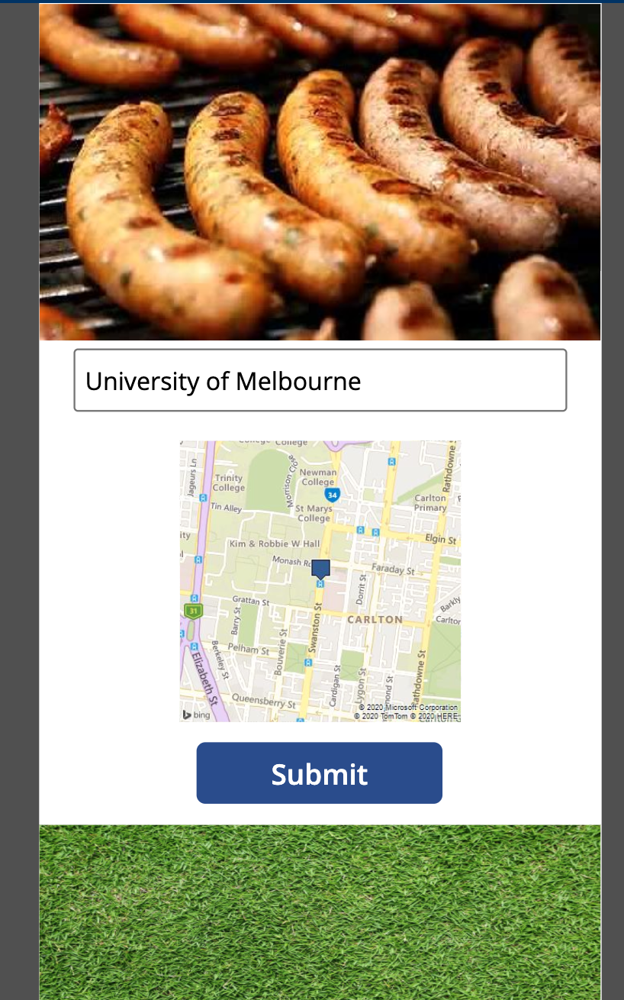
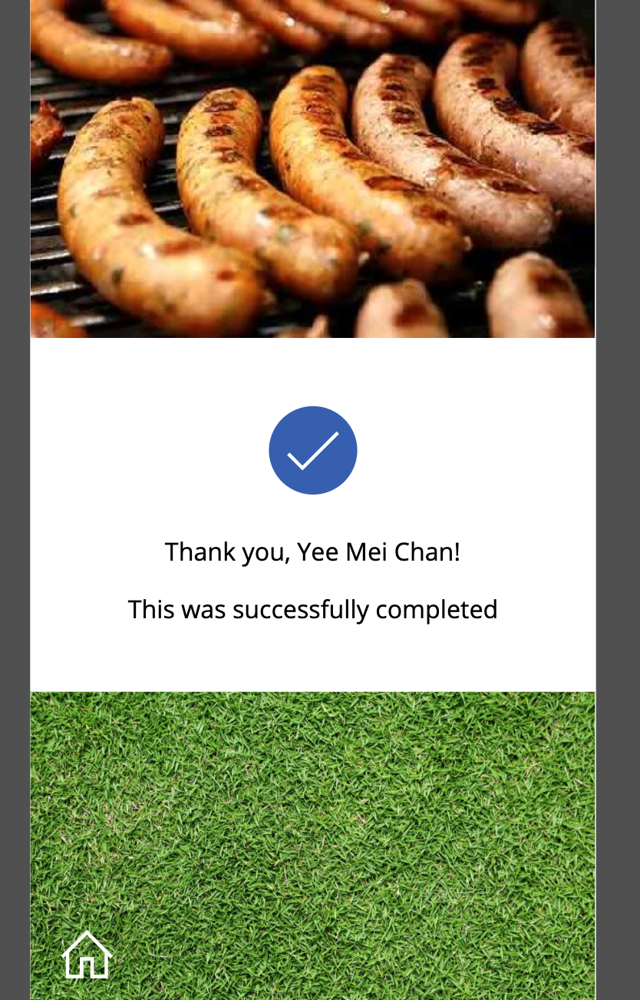

# Free Snag Sighting PowerApp

The target persona of my app is a typical university student in their 20s. After a long class, they stumble across an event offering free snags. Conscious that other students on tight budgets would also enjoy the free food, they want to share the location of the event with others. This is where the app comes in. By entering their location, with the help of Bing Maps they can send that information to the app for it to be stored and used to alert its users. They can verify their location based on the displayed map image. Doing so, satisfies the persona's desire to do good by their peers in making sure everyone has the opportunity to enjoy a free snag. 

The app can be expanded to accommodate students sharing locations of relevant events, which might be taking place. As such, the app may appeal to student clubs and event organizers. Future modifications of the app may include a more detailed and accurate campus map or functionality to pinpoint a location on a map. These improvements would be useful for users.

The PowerApp consists of three screens which are the welcome, submission and completion screen. An image of each screen is given below. 

